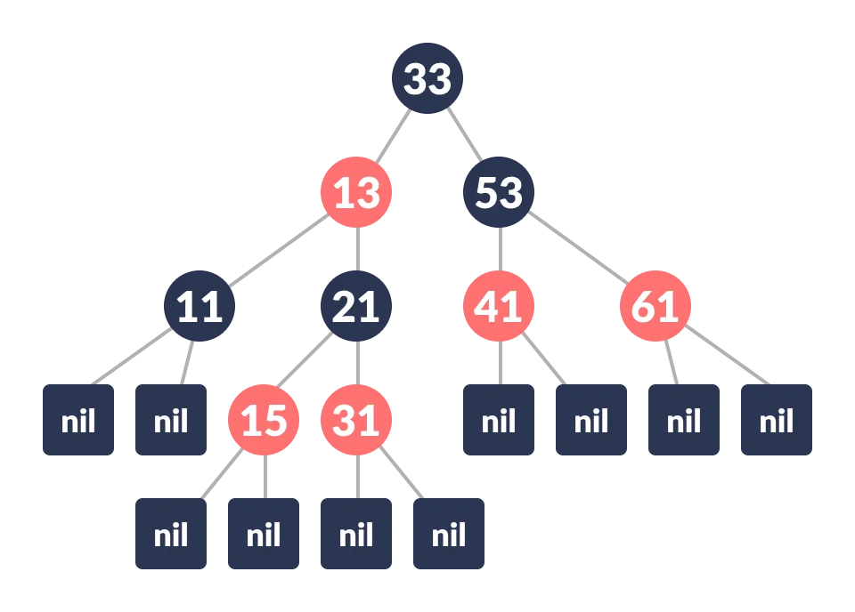

# containers


*Kendrick Lamar - euphoria*<br>
*Have you ever played have-you-ever?*

This project is a reimplementation of Standard Template Library's *set* and *map* containers.<br>

## Contents
- [Installation](#installation)
- [Introduction to STL](#introduction-to-stl)
  - [Motivation](#motivation)
  - [Containers](#containers-1)
    - [Sequence Containers](#sequence-containers)
    - [Associative Containers](#associative-containers)
    - [Unordered Associative Containers](#unordered-associative-containers)
    - [Container Adaptors](#container-adaptors)
  - [Algorithms](#algorithms)
- [Red-Black Tree](#red-black-tree)
- [Iterators](#iterators)
  - [What is it?](#what-is-it)
  - [Types](#types)
    - [Input/Output](#inputoutput)
    - [Forward](#forward)
    - [Bidirectional](#bidirectional)
    - [Random Access](#random-access)
    - [Contiguous](#contiguous)
- [Vector](#vector)
- [Stack](#stack)
- [Array](#array)
- [List](#list)
  - [Forward list](#forward-list)
- [Deque](#deque) 
  - [Queue](#queue)
- [Set](#set)
- [Map](#map)
- [Multiset](#mulstiset)
- [Multimap](#multimap)
- [Unordered set](#unordered-set)
- [Unordered map](#unordered-map)

## Installation

Usage:
```c++

#include "containers.h"

int main(){
    
    s21::set a = {1,2,3,4,5};   // creates the set (1,2,3,4,5)
    a.insert(6);                // adds 6 to it (1,2,3,4,5,6)
    a.erase(5);                 // removes 5 from the set (1,2,3,4,6)
    a.insert(6);                // does nothing because we already have 6 (1,2,3,4,6)
    size_t sz = a.size();       // returns set's size: 5
    auto bg = a.begin();        // returns begin iterator
    auto it = a.find(3);        // returns an iterator to the found element, otherwise nullptr
}

```

Run tests:
```shell
git clone https://github.com/georghegel/containers.git && cd containers
make test
```

Check for memory leaks:
```shell
make leaks
```

## Introduction to STL
### Motivation
The Standard Template Library (STL) in C++ is a powerful and flexible library that provides a collection of generic classes and functions. The motivation behind the development of the STL can be summarized in several key points:
1. Code Reusability<br>
   >One of the primary motivations for the STL is to promote code reusability. By providing a standardized set of data structures and algorithms, the STL allows developers to avoid writing common functionalities from scratch. This not only saves development time but also ensures that these implementations are well-tested and optimized.

2. Efficiency and Performance<br>
   >The STL is designed with a strong emphasis on performance. The algorithms and data structures provided by the STL are implemented to be as efficient as possible, leveraging the strengths of C++ such as low-level memory manipulation and inlining of template code. This makes STL a go-to choice for performance-critical applications.

3. Generic Programming<br>
   >STL embodies the principles of generic programming. It allows developers to write code that is independent of any specific data type, using templates. This means the same data structure or algorithm can be used with different types, enhancing flexibility and reducing redundancy in the codebase. For example, the same std::vector can be used to store int, double, or even user-defined types.

4. Consistency and Interoperability<br>
   >By providing a standardized library, STL ensures consistency across different projects and teams. It establishes a common vocabulary and set of expectations, making it easier for developers to understand and integrate each other’s code. This is especially important in large-scale projects and in industries where collaboration and code maintenance are critical.

5. Extensibility<br>
   >STL is designed to be extensible. Developers can create their own container classes or algorithms that can work seamlessly with existing STL components. This extensibility allows the STL to be adapted and extended to suit specific needs without compromising the overall structure and design.

6. Robustness and Reliability<br>
   >The components of the STL are extensively tested and used widely in the industry, ensuring a high degree of reliability. Using STL allows developers to rely on robust implementations, reducing the likelihood of bugs and errors in fundamental data structures and algorithms.

7. Separation of Data Structures and Algorithms<br>
   >STL separates the implementation of data structures (containers) from the implementation of algorithms. This separation allows algorithms to operate on any container that adheres to the expected interface (iterators), promoting a more modular and flexible design. For example, the std::sort algorithm can sort any container that provides random-access iterators, such as std::vector or std::deque.

8. Ease of Use<br>
   >STL provides a rich set of functionality with a relatively simple and consistent interface. This makes it easier for developers to learn and use. The intuitive design of STL components, such as containers, iterators, and algorithms, simplifies many common programming tasks, allowing developers to focus on higher-level logic rather than low-level implementation details.


### Containers

The Standard Template Library (STL) in C++ provides a variety of containers, each designed to handle different types of data storage and access patterns efficiently. Here is a list of the main STL containers along with a brief description of each:<br>

*As of 29.05.2024 I've only implemented set and map. Will implement other ones in future*

#### Sequence Containers
1. `std::vector`
2. `std::deque`
3. `std::list`
4. `std::forward_list`
5. `std::array`

#### Associative Containers
1. `std::set`
2. `std::multiset`
3. `std::map`
4. `std::multimap`

#### Unordered Associative Containers
1. `std::unordered_set`
2. `std::unordered_multiset`
3. `std::unordered_map`
4. `std::unordered_multimap`

#### Container Adaptors
1. `std::stack`
2. `std::queue`
3. `std::priority_queue`

### Algorithms

## Red-Black Tree

Under the set and the map containers we have data structure that will contain our data.
For computational efficiency both of these containers have Red-Black Tree as a data structure.<br>
In worst case for insertion and deletion we have: $$\color{black}O(\log(n))$$

By Cormen et al. book we have next properties of the RBT:<br>
> A red-black tree is a binary search tree with one extra bit of storage per node: its color, which can be either $${\color{red}RED}$$ or $${\color{black}BLACK}$$<br>
By constraining the way nodes can be colored on any path from the root to a leaf, red-black trees ensure that no such path is more than twice as long as any other, so that the tree is approximately balanced.<br>
Each node of the tree now contains the fields color, key, left, right, and p. If a child or the parent of a node <br>
does not exist, the corresponding pointer field of the node contains the value NIL. <br>
We shall regard these NIL'S as being pointers to external nodes (leaves) of the binary search tree and the normal, key-bearing nodes as being internal nodes of the tree.<br>
A binary search tree is a red-black tree if it satisfies the following red-black properties:
> 1. Every node is either red or black.
> 2. Every leaf (NIL) is black.
> 3. If a node is red, then both its children are black.
> 4. Every simple path from a node to a descendant leaf contains the same number of black nodes

For the full understanding:
1. [Wikipedia](https://en.wikipedia.org/wiki/Red%E2%80%93black_tree)
2. [Cormen et al.](https://www.amazon.com/Introduction-Algorithms-3rd-MIT-Press/dp/0262033844)

## Iterators

We will not invent the wheel and will define iterators as it defined in a C++ Standard:
```
1.
Iterators are a generalization of pointers that allow a C++ program to work with different data structures
(for example, containers and ranges) in a uniform manner. To be able to construct template algorithms
that work correctly and efficiently on different types of data structures, the library formalizes not just the
interfaces but also the semantics and complexity assumptions of iterators. An input iterator i supports the
expression *i, resulting in a value of some object type T, called the value type of the iterator. An output
iterator i has a non-empty set of types that are indirectly_writable to the iterator; for each such type T,
the expression *i = o is valid where o is a value of type T. For every iterator type X, there is a corresponding
signed integer-like type (23.3.4.4) called the difference type of the iterator.
        
2.
Since iterators are an abstraction of pointers, their semantics are a generalization of most of the semantics of
pointers in C++. This ensures that every function template that takes iterators works as well with regular
pointers. This document defines six categories of iterators, according to the operations defined on them: input
iterators, output iterators, forward iterators, bidirectional iterators, random access iterators, and contiguous
iterators, as shown in Table 83.
```

Table 83: Relations among iterator categories [tab:iterators.relations]


### Types

Each higher level iterator contains all properties of the previous levels.<br>
For example, Bidirectional iterator has the properties of the Forward, which has all properties of the I/O.<br>

Picture should make it clear:<br><br>


#### Input/Output

> The input_iterator concept defines requirements for a type whose referenced values can be read (from the
requirement for indirectly_readable (23.3.4.2)) and which can be both pre- and post-incremented.

Means that we can iterate over ++a and a++ operators.<br>
And also can read the values by "*" operator.

> The output_iterator concept defines requirements for a type that can be used to write values (from the
requirement for indirectly_writable (23.3.4.3)) and which can be both pre- and post-incremented.

Same as above + we can write in it. 

#### Forward

> The forward_iterator concept adds copyability, equality comparison, and the multi-pass guarantee.

Added equality comparison (multi-pass guarantee I haven't researched yet)

Use cases: forward_list

#### Bidirectional

> The bidirectional_iterator concept adds the ability to move an iterator backward as well as forward.

Added: --a and a--

Use cases: set, map, multiset, multimap, list, queue

#### Random Access

> The random_access_iterator concept adds support for constant-time advancement with +=, +, -=, and -,
as well as the computation of distance in constant time with -. Random access iterators also support array
notation via subscripting.

New properties and operations are given below:
```c++
template<class I>
    concept random_access_iterator =
        bidirectional_iterator<I> &&
        derived_from<ITER_CONCEPT(I), random_access_iterator_tag> &&
        totally_ordered<I> &&
        sized_sentinel_for<I, I> &&
        requires(I i, const I j, const iter_difference_t<I> n) {
            { i += n } -> same_as<I&>;
            { j + n } -> same_as<I>;
            { n + j } -> same_as<I>;
            { i -= n } -> same_as<I&>;
            { j - n } -> same_as<I>;
            { j[n] } -> same_as<iter_reference_t<I>>;
        };
```

Use cases: vector, deque

#### Contiguous

> The contiguous_iterator concept provides a guarantee that the denoted elements are stored contiguously
in memory.

*Haven't learned yet*

Use cases: array

## Vector

## Stack

## Array

## List
### Forward list

## Deque
### Queue

## Set

## Map

## Multiset

## Multimap

## Unordered set

## Unordered map

## References

[[1] Standard Template Library](https://en.wikipedia.org/wiki/Standard_Template_Library)<br>
[[2] Algorithms](https://en.wikipedia.org/wiki/Algorithm_(C%2B%2B))<br>
[[3] Iterators](https://en.wikipedia.org/wiki/Iterator)<br>
[[4] Red Black Tree](https://en.wikipedia.org/wiki/Red%E2%80%93black_tree)<br>
[[5] C++ Standard](https://isocpp.org/files/papers/N4860.pdf)<br>

