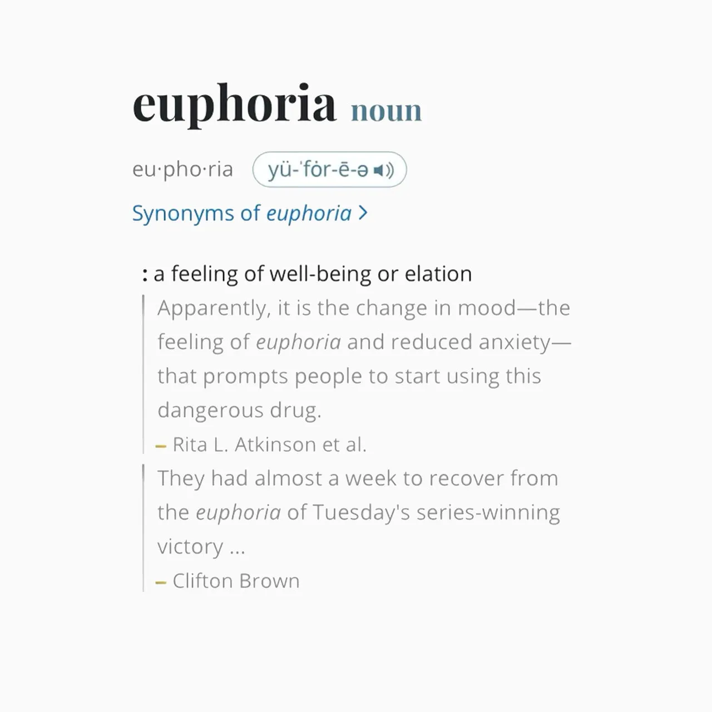

# containers

*Kendrick Lamar - euphoria* 
*Have you ever played have-you-ever?*

This project is a reimplementation of Standard Template Library's *set* and *map* containers. 

## Contents
- [Introduction to STL](#introduction-to-stl)
  - [Motivation](#motivation)
  - [Containers](#containers-1)
  - [Algorithms](#algorithms)
- [Red-Black Tree](#red-black-tree)
- [Iterators](#iterators)
  - [What is it?](#what-is-it)
  - [Types](#types)
- [Set](#set)
- [Map](#map)

## Introduction to STL
### Motivation
### Containers
### Algorithms

## Red-Black Tree
Under the set and the map containers we have data structure that will contain our data.
For computational efficiency both of these containers have Red-Black Tree as a data structure. 
In worst case for insertion and deletion we have: $$\color{black}O(\log(n))$$

By Cormen et al. book we have next properties of the RBT: 
> A red-black tree is a binary search tree with one extra bit of storage per node: its color, which can be either $${\color{red}RED}$$ or $${\color{black}BLACK}$$ 
By constraining the way nodes can be colored on any path from the root to a leaf, red-black trees ensure that no such path is more than twice as long as any other, so that the tree is approximately balanced. 
Each node of the tree now contains the fields color, key, left, right, and p. If a child or the parent of a node  
does not exist, the corresponding pointer field of the node contains the value NIL.  
We shall regard these NIL'S as being pointers to external nodes (leaves) of the binary search tree and the normal, key-bearing nodes as being internal nodes of the tree. 
A binary search tree is a red-black tree if it satisfies the following red-black properties:
> 1. Every node is either red or black.
> 2. Every leaf (NIL) is black.
> 3. If a node is red, then both its children are black.
> 4. Every simple path from a node to a descendant leaf contains the same number of black nodes

For the full understanding:
1. [Wikipedia](https://en.wikipedia.org/wiki/Red%E2%80%93black_tree)
2. [Cormen et al.](https://www.amazon.com/Introduction-Algorithms-3rd-MIT-Press/dp/0262033844)

## Iterators

### What is it

### Types

## Set

## Map
